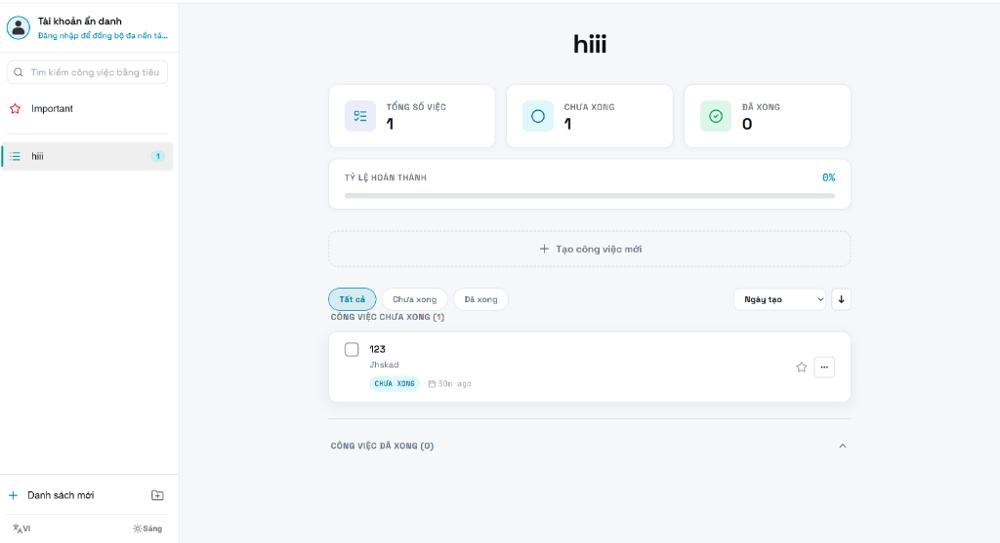

# Premium Todo Manager - Frontend Client

A responsive, high-performance task management frontend built with React 19, TypeScript, Vite, TanStack Query, and native CSS custom properties. It offers a premium visual experience with glassmorphism, responsive adjustments, and dual-language (English and Vietnamese) support.



---

## 🎨 User Interface & Components Description

The interface follows a clean, single-screen dashboard layout designed to maximize productivity and keep tasks organized:

### 1. Sidebar & Navigation Control
- **Profile Card**: Displays the current anonymous user session. Includes a localization translation reminder to log in to sync tasks.
- **Group & List Manager**: Create and organize tasks by Group (Folders) or lists. Includes real-time indicators for pending count.
- **Settings Panel**: Exposes controls for switching themes (Dark/Light Mode) and system languages (English/Vietnamese) instantly.

### 2. Stats Dashboard
- **Counter Summary Cards**: Real-time counter metrics for **Total Tasks**, **Pending Tasks**, and **Completed Tasks**.
- **Progress Indicator Bar**: Interactive completion rate percentage tracker showing progress at a glance.
- **Hover Micro-animations**: Soft hover scale up (+2px) with neon glow borders.

### 3. Controls & Filter Bar
- **Filter Chips**: Filter lists by status (`All`, `Pending`, `Completed`).
- **Sort Select & Order Toggle**: Sort tasks by **Created Date**, **Updated Date**, or **Alphabetical Order**. Supports a directional order toggle using clean Lucide icons.
- **Alignment Rules**: Aligned with card content margins (`padding: 0 var(--space-24)`) to ensure grid alignment across all screen sizes.

### 4. Todo Lists (List View)
- **Pending Tasks Section**: Always prioritized at the top of the dashboard.
- **Completed Tasks Section**: Collapsible list located at the bottom to prevent screen clutter.
- **Task Item Cards**:
  - **Status Checkbox**: Interactive check states.
  - **Importance Indicator**: Stars task as important with custom indicator colors.
  - **Relative Time**: Displays creation times dynamically (e.g., "Just now", "2 hours ago", "Yesterday").
  - **Execution Time**: Displays start/end schedules when configured.
  - **Menu Actions**: Access edit or delete controls easily.

---

## 📱 Responsive & Design Standards

- **Desktop Layout (768px+)**: Displays a side navigation bar and wide main content area.
- **Tablet Layout (480px - 768px)**: Adapts spacing, reducing main padding to `var(--space-24)` and cards margins.
- **Mobile View (Under 480px)**: Collapses the sidebar into an interactive overlay toggleable from a hamburger header button. Margins reduce to `16px` for screen efficiency.
- **Color Contrast**: Compliant with WCAG accessibility guidelines. Utilizes HSL-based palettes with custom focus outlines and disabled states.

---

## ⚙️ Local Development Setup

1. **Install Dependencies**:
   ```bash
   npm install
   ```

2. **Configure Environment Variables**:
   Create a `.env` file at the root of the Frontend folder:
   ```env
   VITE_API_URL=http://localhost:3002
   ```

3. **Start Development Server**:
   ```bash
   npm run dev
   ```
